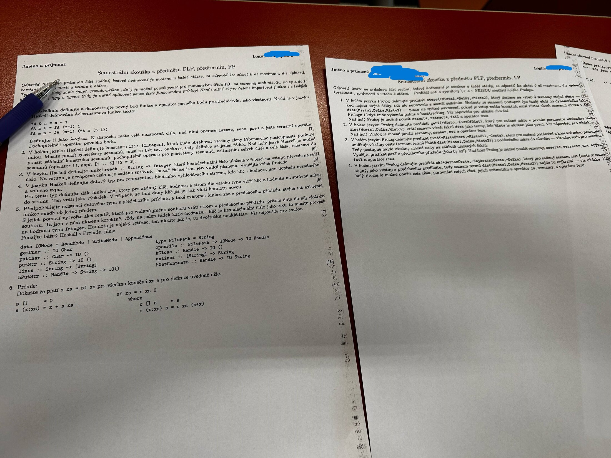

# 2024/2025 - předtermín foto fragment

## Metadata

| Pole | Hodnota |
|---|---|
| Status | `photo transcript` |
| Primární zdroj | Discord pin `1372587942802882621`, foto `bb441125-417b-4018-9534-1b6c92497133.jpg` |

## Zdroje

- Normalizovaný digest: [[raw/manual/pin-assignments|raw/manual/pin-assignments]], sekce `2024/2025 - předtermín, foto fragment`.
- Primární signál: Discord pin `1372587942802882621`, 15. 5. 2025.
- Veřejná kopie fotky je zmenšená a bez EXIF metadat.

## FP/Haskell

1. Lambda-kalkul: definovat a demonstrovat pevný bod a operátor pevného bodu; definovat Ackermannovu funkci jako lambda-výraz.
2. `lfi :: [Integer]`: nekonečný seznam Fibonacciho posloupnosti jako one-liner.
3. `readh :: String -> Integer`: převést validní hexadecimální řetězec s velkými písmeny na celé číslo.
4. Definovat datový typ pro BST a funkci `ins`, která vloží nebo nahradí hodnotu podle klíče.
5. IO akce `readf`: ze souboru s řádky `klíč:hodnota`, kde klíč je hex řetězec, sestavit BST.
6. Bonus: dokázat ekvivalenci přímé a akumulační sumy seznamu.

## LP/Prolog

1. `store(+Mista1,+Delky,+Mista2)` uloží fakty `dist(Misto1,Delka,Misto2)`; při různých délkách vstupních seznamů selže.
2. `getT(+Misto,-TList)` vrátí všechny fakty `dist(Misto,Delka,Misto2)`.
3. `findC(+MistoStart,+MistoCil,-Cesta)` najde cesty ze startu do cíle.
4. `sh(+SeznamCest,-NejkratsiCesta,-Delka)` vybere nejkratší cestu.

## Poznámka

Fotka zachycuje více listů najednou; některé body jsou fragmentární.
