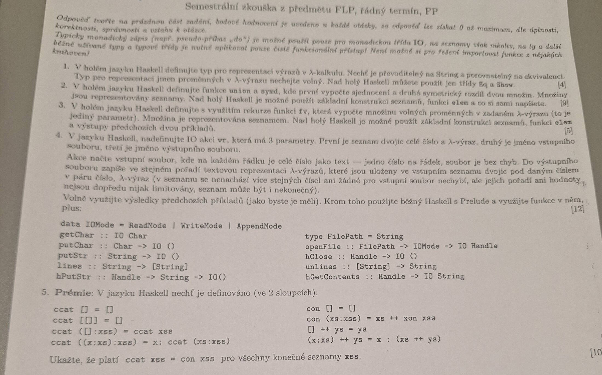
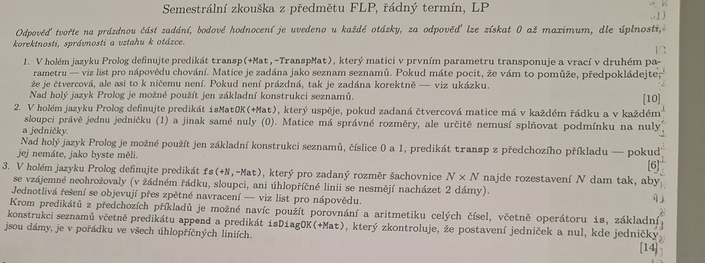

# 2024/2025 - řádný termín foto

## Metadata

| Pole | Hodnota |
|---|---|
| Status | `photo transcript` |
| Primární zdroj | Discord pin `1374046174633267281`, fotky z 19. 5. 2025 |

## Zdroje

- Normalizovaný digest: [[raw/manual/pin-assignments|raw/manual/pin-assignments]], sekce `2024/2025 - řádný termín, foto`.
- Primární signál: Discord pin `1374046174633267281`, 19. 5. 2025.
- Veřejné kopie fotek jsou zmenšené a bez EXIF metadat.

## FP/Haskell

1. Definovat typ pro reprezentaci lambda-výrazů. Typ jmen proměnných je volný, ale musí být převoditelný na `String` a porovnatelný na ekvivalenci. Nad holý Haskell jen `Eq` a `Show`.
2. Definovat `union` a `symd` pro množiny reprezentované seznamy; lze použít základní konstrukci seznamů, `elem` a vlastní funkce.
3. Definovat rekurzivní `fv` pro množinu volných proměnných v lambda-výrazu; využít předchozí výsledky.
4. IO akce `wr` se třemi parametry: seznam dvojic `(číslo, lambda-výraz)`, vstupní soubor, výstupní soubor. Načte čísla po řádcích a do výstupu zapíše odpovídající textové reprezentace lambda-výrazů.
5. Bonus: dokázat `ccat xss = con xss` pro všechny konečné seznamy `xss`.

## LP/Prolog

1. `transp(+Mat,-TranspMat)` transponuje matici zadanou jako seznam seznamů.
2. `isMatOK(+Mat)` uspěje, pokud čtvercová matice má v každém řádku a každém sloupci právě jednu `1` a jinak jen `0`.
3. `fs(+N,-Mat)` najde rozmístění `N` dam na šachovnici `N x N`, aby se neohrožovaly.

## Aktuální relevance

FP/Haskell část je silně relevantní. LP/Prolog část je od 2025/2026 nahrazená Rustem.
