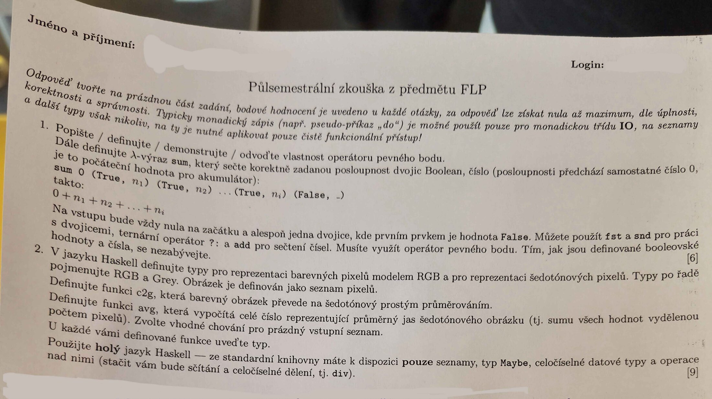

# 2025/2026 - půlsemestrálka signal

## Metadata

| Pole | Hodnota |
|---|---|
| Status | `pin exact` + foto |
| Primární zdroj | Discord piny `1485649559534305442`, `1485622017477709956` |

## Zdroje

- Normalizovaný digest: [[raw/manual/pin-assignments|raw/manual/pin-assignments]], sekce `2025/2026 - půlsemestrálka signal`.
- Primární signály: Discord piny `1485649559534305442` a `1485622017477709956`, 23. 3. 2026.
- Veřejná kopie fotky je zmenšená a bez EXIF metadat.

## Zadání z přepisu

1. V lambda-kalkulu definovat funkci `odds`, která spočítá všechna lichá čísla v seznamu tvaru `0 n1 n2 ... n 0`, kde první `0` je akumulátor a poslední `0` konec seznamu. Dostupné: `iseven`, `iszero`, ternární operátor.
2. V Haskellu definovat `Grade` pro známky A-F a `Result` s id studenta a známkou; napsat funkci `ht`, která vypíše histogram známek ve formátu `Známka: Počet` a nevypisuje nulové četnosti.

## Vztah ke zkoušce

Není to finální zkouška, ale potvrzuje aktuální kombinaci lambda-kalkul + Haskell datové typy/výstup.
